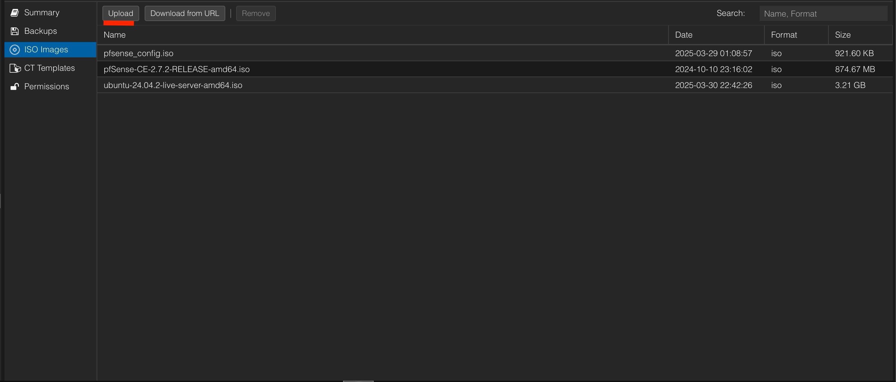

---

# Virtualizing pfSense on Proxmox VE: Initial Setup Guide

This guide will walk you through the initial setup of pfSense as a virtual machine (VM) on your Proxmox VE host. pfSense will act as your network's firewall and router, providing advanced security and networking features.

## Prerequisites

Before you begin, ensure you have the following:

- **Proxmox VE Installed:** You should have a fully functional Proxmox VE server as detailed in the "Proxmox VE 8.x Installation Guide".
- **Dedicated Ethernet Ports for pfSense:** Your Proxmox server should have at least **2 dedicated physical Gigabit Ethernet ports** that will be passed through to the pfSense VM.
  - **Important Note on NICs:** pfSense generally has excellent hardware compatibility, but it's known to have issues with certain **Broadcom Network Interface Cards (NICs)**. Intel NICs are generally preferred and highly reliable for pfSense. Verify your NICs are not Broadcom if you encounter unusual network issues.
  - **3 Ethernet Ports (Recommended):** This guide will detail steps for a 3-port setup (WAN, LAN, and an optional third port for a DMZ or dedicated network). The principles are easily adaptable for a 2-port setup.
- **pfSense ISO Image:** Downloaded to your local machine.

## Part 1: Proxmox VE Configuration for pfSense VM

### Step 1: Download pfSense Installer Image

1.  Visit the official Netgate pfSense downloads page. You'll typically want the `AMD64 (64-bit)` architecture.
    - **Link:** `https://atxfiles.netgate.com/mirror/downloads/`
    - Look for a release named something like `pfSense-CE-memstick-SERIAL-2.x.x-RELEASE-amd64.iso.gz` (or just `.iso`). Download the latest stable CE (Community Edition) version.

### Step 2: Upload pfSense ISO to Proxmox

1.  Access your Proxmox VE web interface (`https://YOUR_PROXMOX_IP:8006`).
2.  In the left-hand navigation pane, select your Proxmox node (e.g., `pve`).
3.  Click on **`local (pve)`** under the "Storage" section.
4.  In the main panel, click on **`ISO Images`**.
5.  Click the **`Upload`** button.
6.  Click "Select File" and browse to the pfSense ISO image you downloaded on your local computer.
7.  Click "Upload".

_(An image showing the Proxmox ISO upload interface would be helpful here if you choose to include it in your final guide.)_

### Step 3: Create the pfSense Virtual Machine

1.  In the Proxmox web interface, click on the **`Create VM`** button (usually at the top right).
2.  **General Tab:**
    - **Node:** Select your Proxmox node (e.g., `pve`).
    - **VM ID:** Leave as default (e.g., `100`).
    - **Name:** Enter a descriptive name like `pfSense-Router`.
    - Click `Next`.
    
3.  **OS Tab:**
    - **Select "Do not use any media" from the dropdown.** (We'll attach it later).
    - **Guest OS:**
      - **Type:** `Other`
      - **Version:** `Other`
    - Click `Next`.
    
4.  **System Tab:**
    - **Graphic card:** `Default`
    - **BIOS:** `SeaBIOS` (This is important for compatibility with pfSense)
    - **Machine:** `q35` (Recommended for modern virtual hardware features)
    - **SCSI Controller:** `VirtIO SCSI single` (Better performance than LSI)
    - Check `Qemu Agent` (Though not strictly necessary for pfSense, it's good practice for other VMs).
    - Click `Next`.
    
5.  **Disks Tab:**
    - **Bus/Device:** `VirtIO Block` (For best performance)
    - **Storage:** Select `local-lvm` (or your preferred storage for VMs).
    - **Disk Size:** `8 GB` (This is more than enough for pfSense OS and logs. You can always increase it later if needed, but it's rarely necessary).
    - Check `Discard` (enables TRIM for SSDs).
    - Check `SSD emulation` (if your storage is SSD).
    - Click `Next`.
    
6.  **CPU Tab:**
    - **Cores:** `1` (A good starting point for pfSense; can be increased if you run many packages or high throughput).
    - **Type:** `host` (For optimal performance, allowing pfSense to use your host CPU's features).
    - Click `Next`.
    
7.  **Memory Tab:**
    - **Memory (MiB):** `4096` MB (4 GiB) is recommended for pfSense to run smoothly, especially with packages like Snort/Suricata, OpenVPN, etc.
    - Click `Next`.
    
8.  **Network Tab:**
    - **Bridge:** Select `No network device`. (We will add the dedicated network bridges in the next steps).
    - Click `Next`.
    
9.  **Confirm Tab:**
    - Review all your settings.
    - **Important:** Check `Start after creation`.
    - Click `Finish`.
    

Your pfSense VM (e.g., VM ID 100) will now appear in the left-hand navigation tree under your Proxmox node.

### Step 4: Create Linux Bridges and Map Physical NICs

This is a critical step to dedicate physical network interfaces to your pfSense VM. You'll create Linux Bridges in Proxmox and then assign your physical NICs to these bridges.

1.  **Identify Physical NICs:**
    Access the Proxmox server's **CLI** (either via SSH into the Proxmox host or by using the console available in the Proxmox web interface for your `pve` node).
    Run the `ip a` command to list all network interfaces. Identify the names of the physical Ethernet ports you want to dedicate to pfSense. These will usually look like `enpXsYfX` or `enoX`.

    
    - **Note:** Your Proxmox management interface (the one with the static IP you set during Proxmox installation) will likely be `vmbr0` and it will be associated with one of your physical NICs. **Do NOT use this physical NIC for pfSense directly if you want to keep Proxmox accessible.** You need to identify two _unused_ physical NICs.

2.  **Create Linux Bridges in Proxmox Web Interface:**

    - Go to your Proxmox web interface.
    - Select your Proxmox node (e.g., `pve`) in the left pane.
    - Go to the **`System`** section, then click on **`Network`**.
    - Click `Create` -\> `Linux Bridge`.
    - **Bridge 1 (for WAN):**
      - **Name:** `vmbr1` (or any other unused bridge ID).
      - **IPv4/IPv6 CIDR:** Leave blank (pfSense will manage the IP).
      - **Bridge ports:** Enter the name of your first dedicated physical NIC (e.g., `enp1s0f0`).
      - **Autostart:** Check this.
      - Click `Create`.
    - **Bridge 2 (for LAN):**
      - **Name:** `vmbr2` (or any other unused bridge ID).
      - **IPv4/IPv6 CIDR:** Leave blank.
      - **Bridge ports:** Enter the name of your second dedicated physical NIC (e.g., `enp1s0f1`).
      - **Autostart:** Check this.
      - Click `Create`.
    - After creating the bridges, click **`Apply Configuration`** at the top right to activate them.

### Step 5: Add Network Bridges to the pfSense VM

Now, you'll attach these newly created bridges to your pfSense VM as network devices.

1.  In the Proxmox web interface, select your `pfSense-Router` VM (e.g., `100 (pfSense-Router)`).

2.  Go to the **`Hardware`** tab.

3.  Click `Add` -\> `Network Device`.

4.  **Network Device 1 (WAN Interface):**

    - **Bridge:** Select `vmbr1` (the bridge you created for WAN).
    - **Model:** `VirtIO (paravirtualized)` (For best performance).
    - Check `Firewall`.
    - Click `Add`.

5.  **Network Device 2 (LAN Interface):**

    - Click `Add` -\> `Network Device` again.
    - **Bridge:** Select `vmbr2` (the bridge you created for LAN).
    - **Model:** `VirtIO (paravirtualized)`.
    - Check `Firewall`.
    - Click `Add`.

### Step 6: Attach pfSense ISO to VM (Bootable)

1.  While still in the `pfSense-Router` VM's **`Hardware`** tab, click on the **`CD/DVD Drive`** (which will likely say `(empty)`).
2.  In the CD/DVD Drive window, select `Use CD/DVD disc image file`.
3.  **Storage:** Select `local (pve)` (or wherever you uploaded the ISO).
4.  **ISO image:** Select your uploaded `pfSense-CE-memstick-SERIAL-2.x.x-RELEASE-amd64.iso` from the dropdown.
5.  Click `OK`.

### Step 7: Configure VM Boot Order

1.  In the `pfSense-Router` VM's **`Options`** tab, double-click on **`Boot Order`**.
2.  Ensure that your `CD-ROM` (the pfSense ISO) is at the top or enabled, so the VM boots from the installer. You can drag and drop to reorder.
3.  Click `OK`.

## Part 2: Initial pfSense Installation and Configuration

Now that your VM is set up in Proxmox with the correct network interfaces, you're ready to install and configure pfSense itself.

1.  **Start the pfSense VM:**

    - In the Proxmox web interface, select your `pfSense-Router` VM.
    - Click the **`Start`** button (green arrow).
    - Once the VM starts, click on the **`Console`** tab in the main panel to view the pfSense installer.

2.  **Follow the FUTO Guide for pfSense Installation:**
   You can pick up directly from **"Step 3: Installing pfSense on the Intel NUC"** in their presentation, as the VM setup and network interface assignments (covered in Part 1 of this guide) prepare you for their steps.

    - **FUTO Guide Link:** `https://wiki.futo.org/index.php/Introduction_to_a_Self_Managed_Life:_a_13_hour_&_28_minute_presentation_by_FUTO_software#Step_3:_Installing_pfSense_on_the_Intel_NUC`

    **Key steps you'll perform in the pfSense console (as detailed in the FUTO guide):**

    - Selecting the installation options (Accept, Install, Auto (UFS)).
    - Configuring WAN and LAN interfaces (assigning `vtnet0` to WAN, `vtnet1` to LAN, etc.).
    - Setting WAN IP (usually DHCP from your ISP modem).
    - Setting LAN IP (e.g., `192.168.5.1` to be your new LAN gateway).
    - Accessing the pfSense web GUI for further configuration.

---

**Hope you found this insightful\!**
